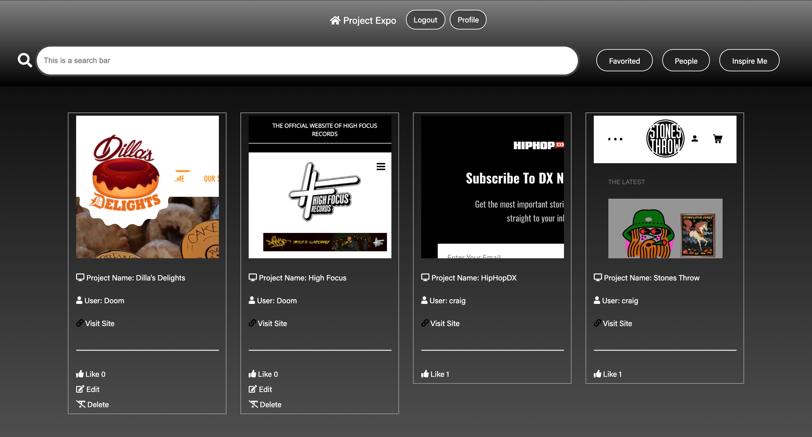

#  Project 4 : ProjectExpo

# Brief

Build a full-stack application by making your own backend and your own front-end
* **Use a Python Django API** using Django REST Framework to serve your data from a Postgres database
* **Consume your API with a separate front-end** built with React
* **Be a complete product** which most likely means multiple relationships and CRUD functionality for at least a couple of models

# Technologies

### Back-end
* Django 
* Python 
* PostreSQL

### Front-end
* CSS3 + SASS
* HTML5
* Javascript (ES6)
* React.js
* Google Fonts 
* Font Awesome

### Dependencies 
* Pipenv
* Pyjwt
* Django Rest Framework
* Psycopg2-binary
* Pylint
* Axios 
* React-router-dom


### Development Tools 
* Git + GitHub
* Heroku 
* Netlify 
* VS Code
* TablePlus

### Contributers
* Bradley Bernard 
* Gursham Singh

# Approach

As a group we discussed various ideas that we felt would allow us to consolidate and implement the new concepts and languages we had just learned the weeks before in class. Based on a class experience where one of the tutors was showing us previous completed projects Bradley came up with the idea of creating a platform where students from the course could showcase all their projects in one place making it easier for the tutors to show a large selection of projects in place. After looking at various existing sites we started whiteboarding to plan our page layout and the database models. 

### Model Realationships


# Back-end 

### Models

We began by discussing our models and whiteboading thier relationships to understand which woudl be 1:1, 1:Many and Many:Many. As we only had a week to complete the project we specifically tried to keep our models simple.

_________

With the models established and realtionsips understood, we then began to code the projects models and then the serializers for working with our data in the front-end. 

#### User Model

```py

from django.db import models
from django.contrib.auth.models import AbstractUser

class User(AbstractUser):
    email = models.CharField(max_length=50)
    profile_image = models.CharField(max_length=250, default='https://www.pngitem.com/pimgs/m/150-1503945_transparent-user-png-default-user-image-png-png.png')
    job_title = models.CharField(max_length=100, blank=True)
    gacohort = models.CharField(max_length=50, blank=True)
    linkedin = models.CharField(max_length=250, blank=True)
    github = models.CharField(max_length=250, blank=True)
    instagram = models.CharField(max_length=250, blank=True)
    twitter = models.CharField(max_length=250, blank=True)
    personalsite= models.CharField(max_length=250, blank=True)
    created_project = models.CharField(max_length= 250, blank=True)

```
#### Project Model

```py
class Project(models.Model):
    project_name = models.CharField(max_length=25)
    url = models.CharField(max_length=300)
    project_type = models.ManyToManyField(
        ProjectType,
        related_name='project',
        blank=True
    )
    favorited_by = models.ManyToManyField(
        'jwt_auth.User',
        related_name='favorites',
        blank= True
    )
    owner = models.ForeignKey(
        'jwt_auth.User',
        related_name='created_projects',
        on_delete=models.CASCADE
    )

    def __str__(self):
        return f'{self.project_name}'
```

________

### Views 

Once we had finished working on the models we then began working on the CRUD functionality by creating the views for Projects.

```py
class ProjectListView(APIView):

    permission_classes = (IsAuthenticatedOrReadOnly, )

    def get(self, _request):
        project = Project.objects.all()
        serialized_project = PopulatedProjectSerializer(project, many=True)
        return Response(serialized_project.data, status=status.HTTP_200_OK)

    def post(self, request):
        request.data['owner'] = request.user.id
        new_project = ProjectSerializer(data=request.data)
        if new_project.is_valid():
            new_project.save()
            return Response(new_project.data, status=status.HTTP_201_CREATED)
        return Response(new_project.errors, status=status.HTTP_422_UNPROCESSABLE_ENTITY)
```

### Authentication 

Using Djangos rest framework and jwt we created the user authentication.

```py
class JWTAuthentication(BasicAuthentication):

    def authenticate(self, request):
        header = request.headers.get('Authorization')
        if not header:
            return None
        if not header.startswith('Bearer'):
            raise PermissionDenied({'detail': 'Invalid Authorization Header'})
        token = header.replace('Bearer ', '')

        try:
            payload = jwt.decode(token, settings.SECRET_KEY, algorithms=['HS256'])
            user = User.objects.get(pk=payload.get('sub'))
        except jwt.exceptions.InvalidTokenError:
            raise PermissionDenied({'detail': 'Invalid Token'})
        except User.DoesNotExist:
            raise PermissionDenied({'detail': 'User Not Found'})

        return (user, token)

```

With the models, serializers and authentication complete, we created a client.http file to test our views before moving on to the front-end of the project.

# Front-end

## Approach

For the front-end the group and I wanted to use an exisiting site for inspiration regarding the layout and basic functionality of our App. After discussing and browsing the www one of the team brought Behance to our attention which we felt was inline with what we were looking to achieve so we set about creating the custom project and profile cards. This was a task that I took upon as I was keen to expand my knowledge of flex-box and CSS/SASS in general so the majority of my work was focused on the user and project cards and populating these with dynamic data.

### Front-end White boading


### UserIndex and ProjectIdex

Firstly, using the React.useEffect hook we made an async request to our API using axios and the ***getAllUsers()*** function we created in the library folder. The axios request is also wrapped in a try catch block to handle errors. 

```js
 React.useEffect(() => {
    const getData = async () => {
      try {
        const response = await getAllUsers()
        setUsers(response.data)
        console.log(response.data)
      } catch (error) {
        setIsError(true)
        console.log(error)
      }
    }
    getData()
  }, [searchTerm])

```

SeachTerm was then added to the dependancy array, which was passed as a prop from the search bar compoment to handle the user filtering functionality we also implemented.  

```js
  const handleInput = (e) => {
    setSearchTerm(e.target.value)
    console.log(e.target.value)
  }
```

```js 
 const filterUsers = () => {
    return (
      users.filter(user => {
        return (
          (user.username.toLowerCase().includes(searchTerm))
        )
      }))
  }
```

With the data request now made and the filter function created, we then, using the map() array method populated the imported UserCard component we had created. This

```js 
 <div className="ProjectIndex-Container">
          { users &&
        filterUsers().map((user) => (

          <UserCard
            key={user.id}
            userId={user.id}
            profileImage={user.profileImage}
            username={user.username}
            gacohort={user.gacohort}
            github={user.github}
            linkedin={user.linkedin}
            personalsite={user.personalsite}
            twitter={user.twitter}
            instagram={user.instagram}
          />
```

All of the keys required from our backend models were passed as props from our userCard.

```js
function UserCard({ id, profileImage , username, gacohort, github, linkedin, instagram, personalsite, twitter, userId })
```


We then created two buttons which we conditionally rendered based on the user being the Author/owner of the profile; Edit and Add project. Which, when the user is logged in and on thier profile page would be displayed, and if they were viewing another users profile would not be displayed. Both buttons when clicked would then Link the user to two forms to either add a new project or edit their profile details.

```js
<Link to="/projects/new">

              {isAuthor(user && user.id) ?
                <button className="addProject"><FontAwesomeIcon icon={faPlus} /> Add Project</button>
                :
                <div />
              }
            </Link>
            <Link to={`/auth/profile/${id}/edit/`}>
              {isAuthor(user && user.id) ?
                <button className="editProfile" ><FontAwesomeIcon icon={faEdit}/> Edit Profile
                </button>
                :
                <div/>
              }
            </Link>
```

## Project ScreenShots

- Home Page


- User Profile


## Wins and Challenges 

Wins

 - Understanding the relationships between the models and getting to grips with PostgreSQL databases.
 - Transferring my understanding of Javascript to be able to use Python.
 - Working in a team and finding version control much easier, mainly branching and merging on gitHub.

 Challenges
 
 - Initially switching from Javascript to Python to create the backend. 
 - We were struggling to display our users data on the the UserCard which was due to us using undercores in our naming of fields - this caused the an issues with stringyfying the data correctly. 

 ## Lessons learned

- I found that we had to revert to the backend on a number of ocassions to change to our models so for the next project I create I would spend more time whitebaording to prevent this.
- Due to a couple of days of de-bugging and therefore the backend taking longer than we had initally hoped, there are a number of features still in complete so I would set my MVP goals to be less ambitions and so that the the final product woudld be more professional looking. 
- Django and Python are exceptional tools to support the development of server side projects however I am looking forward to building another full stack site to help consolidate my learning! 


